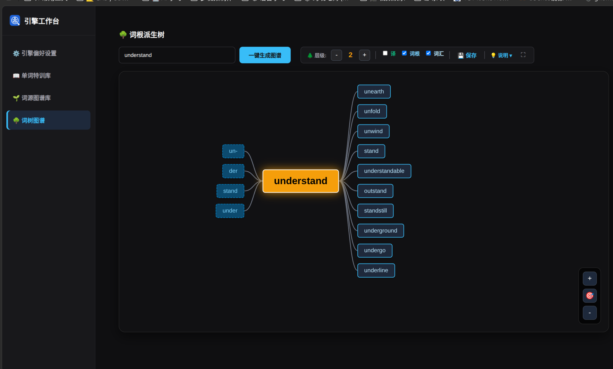
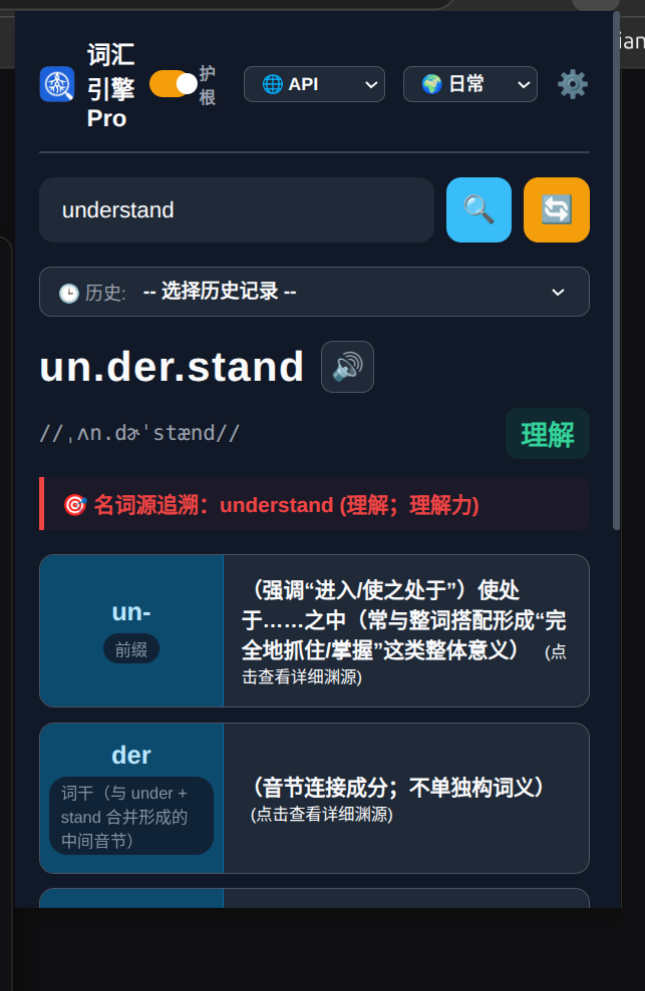
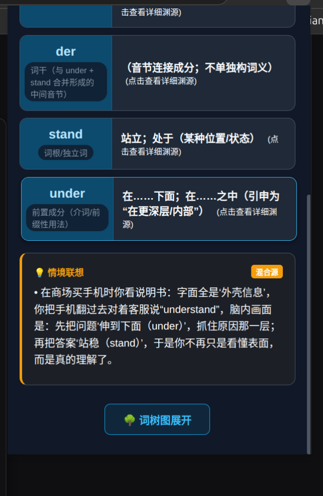
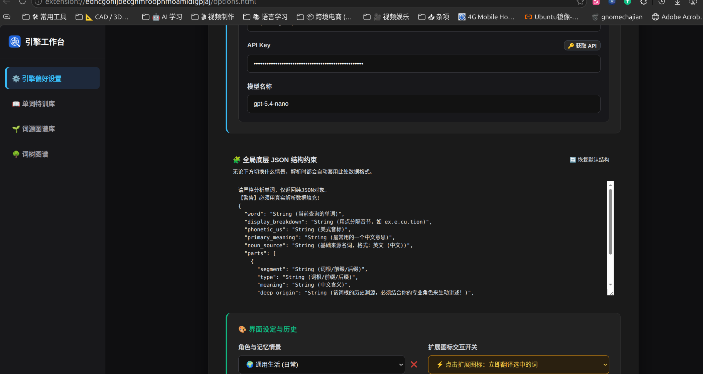
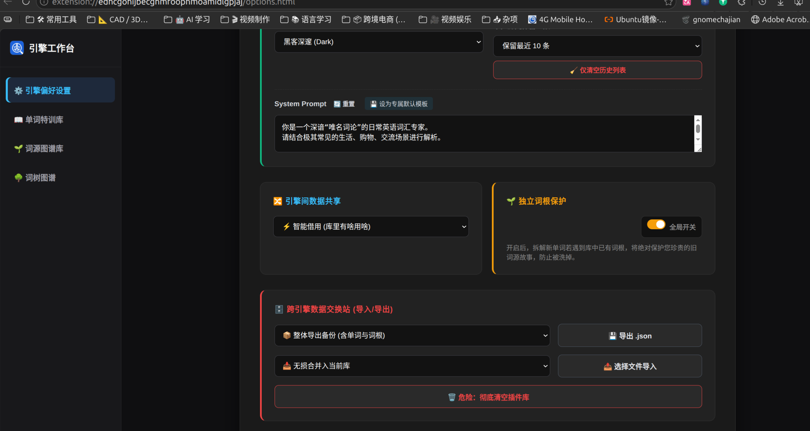
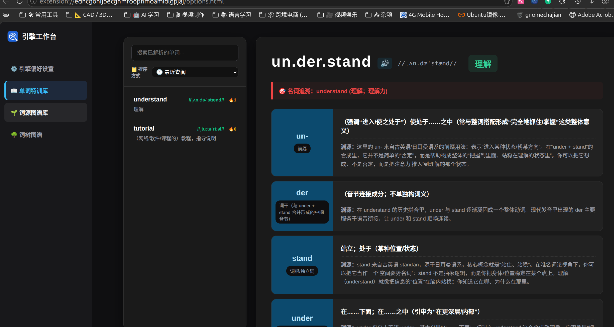

# AI词根记忆 Pro (AI Root English)


## 🌟 项目简介

**AI词根记忆 Pro** 彻底颠覆了传统的死记硬背。它不仅是一个划词翻译工具，更是一个**本地化的私人英语词汇知识库**。

通过调用强大的 AI 大语言模型（支持云端 API 或本地 Ollama），将枯燥的单词瞬间拆解为具有深厚历史渊源的“词根词缀”，并为你生成极具画面感的情境联想。

最新版本引入了 **“词根派生树 (Word Tree)”**，带来媲美 Obsidian / XMind 的无限画布交互体验，让你顺藤摸瓜，将一个词根衍生出的几十个单词一网打尽！

## ✨ 核心特性

### 🧠 双擎驱动，离线可用

- **🌐 远程 API 模式**：兼容 OpenAI, Claude, Gemini 等各大主流 API，解析极速精准。
- **🦙 本地 Ollama 模式**：极客最爱！完全断网运行，零隐私泄露风险，智能接管本地显存释放。
- **🔄 数据回退与保护**：支持引擎间数据共享，独创 **“护根”** 机制，解析新词时绝对保护你珍藏的旧词源故事。

### 🌳 词根派生树 (无限画布)

- **Obsidian 级交互**：原生实现支持鼠标左键拖拽平移、滚轮无级缩放的无限画布。
- **动态裂变生成**：选中任意生词，AI 现场解析并在画布上瞬间“炸开”多级衍生词谱。
- **智能导航控制**：支持双击中键一键居中焦点、右下角悬浮小地图、全屏沉浸模式，以及 1~10 级的递归深度控制。
- **中文释义内嵌**：一键开启“译”开关，节点内部优雅内嵌精简中文释义。

### 🎭 深度情景定制 (Prompt Context)

不仅是翻译，更是“角色扮演”。内置分离式 JSON 底层约束系统，你可以让 AI 扮演：

- 🌍 通用生活日常专家
- 🏛️ 《文明6》资深游戏策划（结合科技树、尤里卡进行记忆）
- 🐧 Linux / AI 极客（结合底层 C++ 内存、终端命令进行讲解）
- ✍️ 完全自定义你的专属导师！

### 📚 完备的本地知识库

- **单词特训库 & 词源图谱库**：双库联动，支持按频次、时间、首字母排序。
- **全量导出/导入**：数据完全掌握在自己手中，支持 JSON 格式无损合并或替换，支持单独提取词根库。
- **跨页面无缝跳跃**：在词树中长按节点，可瞬间跨页面跳回特训库查看详细渊源和语音朗读。

------

## 📸 界面预览












### 方法一：从商店安装 (推荐)

🎉 **Microsoft Edge Add-ons**：*(edg浏览器直接搜索 :AI词根记忆)*

### 方法二：开发者模式手动安装

1. 下载本仓库的代码（或在 Release 页面下载最新的 `.zip` 源码包并解压）。
2. 打开基于 Chromium 的浏览器（Edge / Chrome）。
3. 在地址栏输入 `edge://extensions/` 或 `chrome://extensions/` 并回车。
4. 在页面左下角或右上角开启 **“开发人员模式 (Developer mode)”**。
5. 点击 **“加载解压缩的扩展 (Load unpacked)”** 按钮。
6. 选择你刚才解压的 `ai_root_english` 文件夹，即可安装成功！

------

## ⚙️ 配置与使用

### 1. 配置 API 或 Ollama

- 点击浏览器右上角的扩展图标，点击弹出层右上角的 ⚙️ 齿轮按钮进入**引擎工作台**。
- **若使用 API**：在「远程 API」选项卡填入你的 `Base URL`、`API Key` 和 `模型名称`。
- **若使用 Ollama**：请确保本地已启动 Ollama 客户端。在工作台填入 `http://127.0.0.1:11434`，点击“刷新”获取本地已下载的模型列表。

词库导入 vocab里面的 /vocab/expert.json
[text](https://raw.githubusercontent.com/Zalozheng/ai_root_english/main/vocab/expert.json)

### 2. 开始使用

- **网页划词**：在任意网页选中文本，点击扩展图标即可自动获取并在弹窗中深度解析。
- **查看图谱**：在弹窗底部点击 **“🌳 词树图展开”**，即可进入宏大的无限画布，探索词根宇宙。4
- 


---


>
> 插件使用
>
> 请查阅 [使用说明][docs] [docs]: ./docs.htm
>
> 

------

## 🛠️ 技术栈

- **Manifest V3**：最新的浏览器扩展标准，安全高效。
- **Vanilla JavaScript (ES6+)**：零第三方庞大框架依赖，极致轻量，秒级启动。
- **原生 SVG + CSS Transform**：自主研发的无限画布引擎与平滑贝塞尔曲线计算算法。
- **Chrome Storage API**：构建本地微型数据库，实现跨页面状态同步与持久化记忆。

------
建议:

导入 out-word的数据 就可以离线使用一大部分
当然 你可以用模版 让别的ai 批量生成 json
:你来帮我按照这个格式生成 500个雅思单词吧
每次生成10条 命名为batch1.json batch2.json不用解析


然后 :你自己用out-word的merge_batches.py合成一个json:
batch 必须是batch1.json batch2.json 
然后修改 里面的循环改成循环次数 1-10就把41改成 11

   files_to_merge = [f"batch{i}.json" for i in range(1, 41)

```bash
python merge_batches.py
```

建议用api模式
模型
gpt-5.4-nano (推荐)
gpt-4o-mini-2024-07-18 (也便宜)
glm-4
claude-opus-4-7  (贵一点,做词根浪费)
claude-haiku-4-5-20251001 这个便宜


情景模式可以复制粘贴 或者自己改 或者用原生的 
全局变量 也可以自己改.但是不建议 不懂的人改,类似ai的 系统提示词

自定义:

```json
你是一个深谙“唯名词论”的日常英语词汇专家。
请结合极其常见的生活、购物、交流场景进行解析。

记忆线 (memory_lines)，强制且仅输出 5 个元素（利用空字符串隔开，且内容必须带数字序号）：
[元素 1] 1. 中文(`英文部件`) + 中文(`英文部件`) → **完整单词**(中文释义)。
[元素 2] 强制固定输出空字符串：""
[元素 3] 2. 💡 情景联想：结合【{CONTEXT}】写画面，死守 30 字以内！
[元素 4] 强制固定输出空字符串：""
[元素 5] 3. 极简英文例句带括号中文翻译。
```


------

## 利用skill 创建 单词记忆批量
文档: skill/skill的使用.md
skill
```bash
~/.agents/skills/word-generator
打开 gmini-cli
输入：安装skill word-generator
然后打开输出目录 agy --dangerously-skip-permissions全自动不用受权确认
说:
word-generator 技能，帮我生成关于电脑的50个单词。
ai 就会自动生成50个单词 的json 你直接导入就可以 
注意 必须导入 选择词根加单词的方式 gemini cli 2026.6.18开始 将不能用了 而
Antigravity 就很不合适, 所以推荐卸载gemini 一切的产品 用cloda 或者codex

卸载:
npm uninstall -g @google/gemini-cli
也不要安装 npm install -g @google/antigravity-cli
因为我们给了数据它 开发模型 它谷歌只能付费 不给我们使用,人家好歹
Claude 和 codex知道感嗯.
```
------

## 🤝 贡献与反馈

如果你在使用过程中遇到任何 Bug，或者有更疯狂的脑洞想法（比如支持更多语言、加入艾宾浩斯记忆曲线等），欢迎提交 **Issue** 或发起 **Pull Request**！

如果这个插件帮助了你的英语学习，请给它点一个 ⭐️ **Star** 吧！

## 📄 License

MIT License

```
### 使用示例：
随便用,反正你不会用,如果不读文档
```